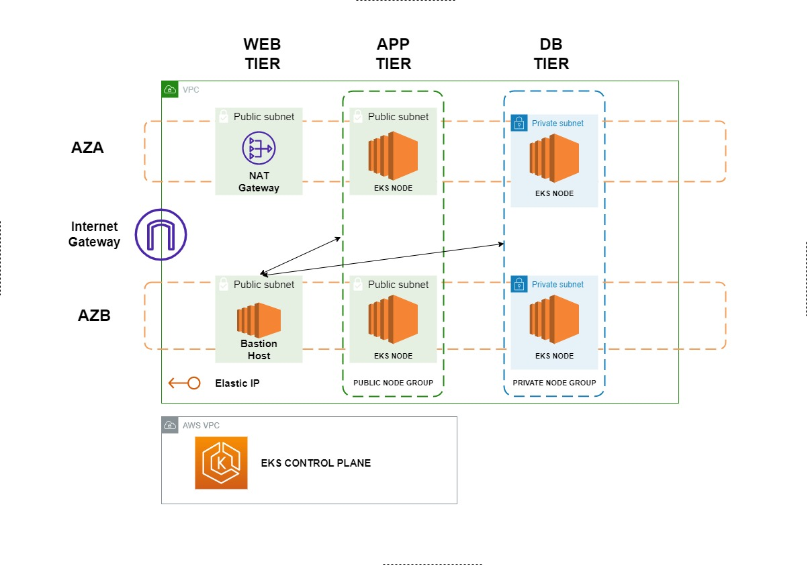

# Terraform-EKS-Architecture
Builds off of the prior terraform projects I've created with the 3-tier VPC and Bastion Host. This goes further to implement AWS' own managed <a href = "https://aws.amazon.com/eks/"> Kubernetes as a service, called EKS,</a> including the control plane and node group.

This project, without doubt has to be one of the most challenging. Setting up EKS on AWS is no small task. A lot of the reference docs would be needed here. If you check the documentaion on thier website, a link is usually labeled "PDF" after the heading. Clicking on this will take you to the full 500 page book referenced for EKS Setup. 

I'm not joking. <a href = "https://docs.aws.amazon.com/pdfs/eks/latest/userguide/eks-ug.pdf#security-iam-awsmanpol"> Its 500 pages</a> 

Just simply knowing the <a href = "https://docs.aws.amazon.com/eks/latest/userguide/service_IAM_role.html"> right roles </a> to attach to the entire <a href = "https://docs.aws.amazon.com/eks/latest/userguide/clusters.html"> EKS Cluster </a> in order to interact with other AWS service, as well ass the role needed by the node group, is throrough work. And those roles might just be generic. Fine tuning it for organisational requirements would be something that would be quite interesting. At least to me.

A list of AWS' own managed policies forr those roles, is <a href = "https://docs.aws.amazon.com/eks/latest/userguide/security-iam-awsmanpol.html" >available here</a>

Please note, that I haven't shown the <a href = "https://docs.aws.amazon.com/AWSEC2/latest/UserGuide/using-eni.html"> ENI's (Elastic Network Interface) </a> that the control plane uses to configure networking with the node group(s). An elastic network interface is automatically attached to the subnets that you specify in Terraform resource block 'aws_eks_cluser' for the 'vpc_config' attribute.

The connections on the <a href = "https://docs.aws.amazon.com/eks/latest/userguide/managed-node-groups.html"> EKS node group </a> will be done via the Bastion host, as expected. To acces AWS services via the terminal, the terraform provisionerrs will come to play here, using the .pem file you would have donwloaded from the IAM User console. 

Kubectl commands can be run once you SSH-ed into the node groups to test whether or not it is running.

